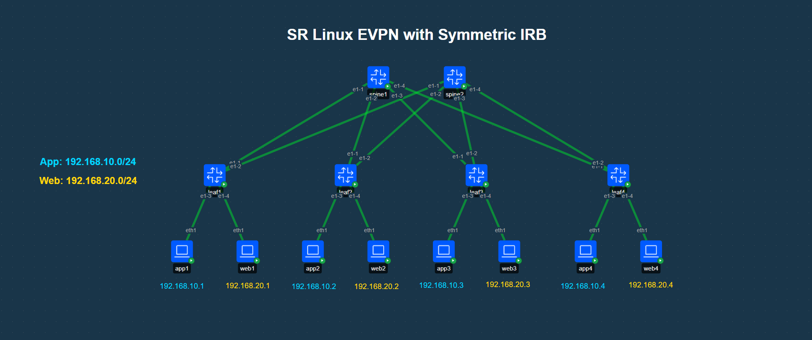

# SR Linux EVPN with Symmetric IRB (Interface-Less / Dual-Label Type-2)

> [!NOTE]
> **EVPN Symmetric IRB Architectural Variants in this Series:**
> - **Method 1 (This Lab - Interface-Less with Dual-Label Type-2, RFC 9135):** [srl-evpn-ifl-irb](https://github.com/andywhitaker/srl-evpn-ifl-irb)
> - **Method 2 (Interface-Less with Type-5 Host Routes, RFC 9136 §4.3):** [srl-evpn-type5-irb](https://github.com/andywhitaker/srl-evpn-type5-irb)
> - **Method 3 (Interface-Ful with SBD, RFC 9136 §4.4):** [srl-evpn-iff-irb](https://github.com/andywhitaker/srl-evpn-iff-irb)

## Topology


## Lab Description
This lab demonstrates **Nokia SR Linux EVPN using Symmetric IRB with Interface-Less (IFL) Dual-Label Routing**, standardized under **RFC 9135**.

In this architecture:
- **Dual-Label EVPN Type-2 Advertising:** Client MAC-VRFs (`app`, `web`) configure `interface-less-routing` to encode **dual labels/VNIs** on EVPN Type-2 MAC-IP routes (Label 1 = Client L2 VNI `10010`/`10020`, Label 2 = Tenant L3 VNI `10000`), accompanied by both L2 and L3 Route Targets.
- **Single BGP Control Plane Message:** A single EVPN Type-2 route simultaneously populates the remote client MAC table for intra-subnet bridging and the remote tenant IP-VRF routing table (`bgp-evpn-ifl-host`) for inter-subnet routing.
- **Direct IP-VRF Tunnel Termination:** The L3 VNI terminates directly in `network-instance tenant1 type ip-vrf` via `vxlan0.100 (type routed)`. No transit bridge domain (Supplementary Broadcast Domain / SBD) or unnumbered IRB interface is required.
- **Optimized BGP Scale for Pure SR Linux:** Reduces BGP control plane prefix count by avoiding separate Type-5 host route advertisements for active endpoints, ideal for homogeneous Nokia SR Linux fabrics.

---

### Architectural Comparison: The Three Symmetric IRB Models

| Architectural Dimension | Method 1: IFL Dual-Label (RFC 9135) | Method 2: IFL Type-5 Host Routes (RFC 9136 §4.3) | Method 3: IFF with SBD (RFC 9136 §4.4) |
| :--- | :--- | :--- | :--- |
| **Standard / Reference** | RFC 9135 | RFC 9136 Section 4.3 | RFC 9136 Section 4.4 |
| **L3 VNI Network Instance** | `tenant1 (type ip-vrf)` | `tenant1 (type ip-vrf)` | `sbd (type mac-vrf)` |
| **VXLAN Interface Type** | `vxlan0.100 (type routed)` | `vxlan0.100 (type routed)` | `vxlan0.100 (type bridged)` |
| **Client MAC-VRF Type-2 Labels** | **Dual Labels:** `10010 + 10000` | **Single Label:** `10010` only | **Single Label:** `10010` only |
| **Host Route Carrier** | EVPN Type-2 MAC-IP | **EVPN Type-5 IP Prefix (/32)** | **EVPN Type-5 IP Prefix (/32)** via SBD |
| **Tenant Routing Table Type** | `bgp-evpn-ifl-host` | `bgp-evpn` | `bgp-evpn-iff` |
| **Next-Hop Resolution** | Direct to Remote VTEP Tunnel | Direct to Remote VTEP Tunnel | Two-Stage via SBD Bridge Table |
| **Inner Wire Payload** | Raw IPv4 / Direct L3 Payload | Raw IPv4 / Direct L3 Payload | Full Ethernet Frame (DMAC=Router MAC) |
| **Multicast Support (OISM)** | Unsupported | Unsupported | Mandatory for RFC 9251 OISM |
| **Target Use-Case** | Pure Nokia / Lowest BGP Prefix Count | Multi-Vendor / Hyperscale IP-VRFs | OISM Multicast & Legacy ASICs |

---


## Containerlab Deployment

```
╭────────┬───────────────────────────────────────────┬─────────┬───────────────────╮
│  Name  │                 Kind/Image                │  State  │   IPv4/6 Address  │
├────────┼───────────────────────────────────────────┼─────────┼───────────────────┤
│ app1   │ linux                                     │ running │ 172.20.20.2       │
│        │ ghcr.io/srl-labs/network-multitool:latest │         │ 3fff:172:20:20::2 │
├────────┼───────────────────────────────────────────┼─────────┼───────────────────┤
│ app2   │ linux                                     │ running │ 172.20.20.7       │
│        │ ghcr.io/srl-labs/network-multitool:latest │         │ 3fff:172:20:20::7 │
├────────┼───────────────────────────────────────────┼─────────┼───────────────────┤
│ app3   │ linux                                     │ running │ 172.20.20.4       │
│        │ ghcr.io/srl-labs/network-multitool:latest │         │ 3fff:172:20:20::4 │
├────────┼───────────────────────────────────────────┼─────────┼───────────────────┤
│ app4   │ linux                                     │ running │ 172.20.20.6       │
│        │ ghcr.io/srl-labs/network-multitool:latest │         │ 3fff:172:20:20::6 │
├────────┼───────────────────────────────────────────┼─────────┼───────────────────┤
│ leaf1  │ nokia_srlinux                             │ running │ 172.20.20.13      │
│        │ ghcr.io/nokia/srlinux:26.3.1              │         │ 3fff:172:20:20::d │
├────────┼───────────────────────────────────────────┼─────────┼───────────────────┤
│ leaf2  │ nokia_srlinux                             │ running │ 172.20.20.11      │
│        │ ghcr.io/nokia/srlinux:26.3.1              │         │ 3fff:172:20:20::b │
├────────┼───────────────────────────────────────────┼─────────┼───────────────────┤
│ leaf3  │ nokia_srlinux                             │ running │ 172.20.20.3       │
│        │ ghcr.io/nokia/srlinux:26.3.1              │         │ 3fff:172:20:20::3 │
├────────┼───────────────────────────────────────────┼─────────┼───────────────────┤
│ leaf4  │ nokia_srlinux                             │ running │ 172.20.20.8       │
│        │ ghcr.io/nokia/srlinux:26.3.1              │         │ 3fff:172:20:20::8 │
├────────┼───────────────────────────────────────────┼─────────┼───────────────────┤
│ spine1 │ nokia_srlinux                             │ running │ 172.20.20.15      │
│        │ ghcr.io/nokia/srlinux:26.3.1              │         │ 3fff:172:20:20::f │
├────────┼───────────────────────────────────────────┼─────────┼───────────────────┤
│ spine2 │ nokia_srlinux                             │ running │ 172.20.20.9       │
│        │ ghcr.io/nokia/srlinux:26.3.1              │         │ 3fff:172:20:20::9 │
├────────┼───────────────────────────────────────────┼─────────┼───────────────────┤
│ web1   │ linux                                     │ running │ 172.20.20.10      │
│        │ ghcr.io/srl-labs/network-multitool:latest │         │ 3fff:172:20:20::a │
├────────┼───────────────────────────────────────────┼─────────┼───────────────────┤
│ web2   │ linux                                     │ running │ 172.20.20.12      │
│        │ ghcr.io/srl-labs/network-multitool:latest │         │ 3fff:172:20:20::c │
├────────┼───────────────────────────────────────────┼─────────┼───────────────────┤
│ web3   │ linux                                     │ running │ 172.20.20.5       │
│        │ ghcr.io/srl-labs/network-multitool:latest │         │ 3fff:172:20:20::5 │
├────────┼───────────────────────────────────────────┼─────────┼───────────────────┤
│ web4   │ linux                                     │ running │ 172.20.20.14      │
│        │ ghcr.io/srl-labs/network-multitool:latest │         │ 3fff:172:20:20::e │
╰────────┴───────────────────────────────────────────┴─────────┴───────────────────╯
```

## Validation
### Client Pings
You should only be able to ping between all client devices in this lab whether intra-subnet or inter-subnet:

| Client | Bridge Domain | Connected To | IP Address   |
| ------ | ------------- | ------------ | ------------ |
| app1   | app           | leaf1        | 192.168.10.1 |
| app2   | app           | leaf2        | 192.168.10.2 |
| app3   | app           | leaf3        | 192.168.10.3 |
| app4   | app           | leaf4        | 192.168.10.4 |
| web1   | web           | leaf1        | 192.168.20.1 |
| web2   | web           | leaf2        | 192.168.20.2 |
| web3   | web           | leaf3        | 192.168.20.3 |
| web4   | web           | leaf4        | 192.168.20.4 |


To ping log into the shell of one of the clients:

``` bash
docker exec -it app1 bash
```

... And attempt to ping another client:

``` bash
/ # ping -c 5 192.168.10.3
PING 192.168.0.3 (192.168.10.3) 56(84) bytes of data.
64 bytes from 192.168.10.3: icmp_seq=1 ttl=64 time=0.545 ms
64 bytes from 192.168.10.3: icmp_seq=2 ttl=64 time=0.515 ms
64 bytes from 192.168.10.3: icmp_seq=3 ttl=64 time=0.511 ms
64 bytes from 192.168.10.3: icmp_seq=4 ttl=64 time=0.560 ms
64 bytes from 192.168.10.3: icmp_seq=5 ttl=64 time=0.549 ms

--- 192.168.10.3 ping statistics ---
5 packets transmitted, 5 received, 0% packet loss, time 4100ms
rtt min/avg/max/mdev = 0.511/0.536/0.560/0.019 ms
```

### BGP Neighbors

```
A:admin@leaf1# show network-instance protocols bgp neighbor
-----------------------------------------------------------------------------------------------------------------------------------------------------------------------------------------------
BGP neighbor summary for network-instance "default"
Flags: S static, D dynamic, L discovered by LLDP, B BFD enabled, - disabled, * slow
-----------------------------------------------------------------------------------------------------------------------------------------------------------------------------------------------
-----------------------------------------------------------------------------------------------------------------------------------------------------------------------------------------------
+---------------------+------------------------------+---------------------+-------+-----------+-----------------+-----------------+---------------+------------------------------+
|      Net-Inst       |             Peer             |        Group        | Flags |  Peer-AS  |      State      |     Uptime      |   AFI/SAFI    |        [Rx/Active/Tx]        |
+=====================+==============================+=====================+=======+===========+=================+=================+===============+==============================+
| default             | 10.1.10.10                   | ebgp-evpn           | S     | 100       | established     | 0d:0h:0m:1s     | evpn          | [0/0/0]                      |
|                     |                              |                     |       |           |                 |                 | ipv4-unicast  | [0/0/0]                      |
| default             | 10.1.20.20                   | ebgp-evpn           | S     | 100       | established     | 0d:0h:0m:2s     | evpn          | [0/0/0]                      |
|                     |                              |                     |       |           |                 |                 | ipv4-unicast  | [0/0/0]                      |
+---------------------+------------------------------+---------------------+-------+-----------+-----------------+-----------------+---------------+------------------------------+
-----------------------------------------------------------------------------------------------------------------------------------------------------------------------------------------------
Summary:
2 configured neighbors, 2 configured sessions are established, 0 disabled peers
0 dynamic peers
```


### MAC Address Table

```
A:admin@leaf1# show network-instance bridge-table mac-table all
-----------------------------------------------------------------------------------------------------------------------------------------------------------------------------------------------
Mac-table of network instance app
-----------------------------------------------------------------------------------------------------------------------------------------------------------------------------------------------
+-----------------+----------------------------------------------+----------+--------------+--------+-------+--------------+--------------+----------------------------------------------+
|     Address     |                 Destination                  |   Dest   |     Type     | Active | Aging |     Not-     |   GBP Tags   |                 Last Update                  |
|                 |                                              |  Index   |              |        |       |  Programmed  |              |                                              |
|                 |                                              |          |              |        |       |    Reason    |              |                                              |
+=================+==============================================+==========+==============+========+=======+==============+==============+==============================================+
| 00:00:5E:00:01: | irb-interface                                | 0        | irb-         | true   | N/A   | none         | N/A          | 2026-04-02T16:17:41.000Z                     |
| 01              |                                              |          | interface-   |        |       |              |              |                                              |
|                 |                                              |          | anycast      |        |       |              |              |                                              |
| 1A:53:06:FF:00: | vxlan-interface:vxlan0.101 vtep:3.3.3.3      | 56997608 | evpn-static  | true   | N/A   | none         | 0            | 2026-04-02T16:18:21.000Z                     |
| 41              | vni:10010                                    | 883      |              |        |       |              |              |                                              |
| 1A:65:07:FF:00: | vxlan-interface:vxlan0.101 vtep:4.4.4.4      | 56997608 | evpn-static  | true   | N/A   | none         | 0            | 2026-04-02T16:18:21.000Z                     |
| 41              | vni:10010                                    | 873      |              |        |       |              |              |                                              |
| 1A:8D:04:FF:00: | irb-interface                                | 0        | irb-         | true   | N/A   | none         | N/A          | 2026-04-02T16:17:41.000Z                     |
| 41              |                                              |          | interface    |        |       |              |              |                                              |
| 1A:C6:05:FF:00: | vxlan-interface:vxlan0.101 vtep:2.2.2.2      | 56997608 | evpn-static  | true   | N/A   | none         | 0            | 2026-04-02T16:18:21.000Z                     |
| 41              | vni:10010                                    | 885      |              |        |       |              |              |                                              |
| AA:C1:AB:20:45: | vxlan-interface:vxlan0.101 vtep:4.4.4.4      | 56997608 | evpn         | true   | N/A   | none         | 0            | 2026-04-02T16:29:02.000Z                     |
| A0              | vni:10010                                    | 873      |              |        |       |              |              |                                              |
| AA:C1:AB:4D:CC: | ethernet-1/3.0                               | 6        | learnt       | true   | 300   | none         | 0            | 2026-04-02T16:29:00.000Z                     |
| 5E              |                                              |          |              |        |       |              |              |                                              |
| AA:C1:AB:7C:08: | vxlan-interface:vxlan0.101 vtep:3.3.3.3      | 56997608 | evpn         | true   | N/A   | none         | 0            | 2026-04-02T16:29:01.000Z                     |
| DA              | vni:10010                                    | 883      |              |        |       |              |              |                                              |
| AA:C1:AB:DD:A7: | vxlan-interface:vxlan0.101 vtep:2.2.2.2      | 56997608 | evpn         | true   | N/A   | none         | 0            | 2026-04-02T16:29:00.000Z                     |
| B7              | vni:10010                                    | 885      |              |        |       |              |              |                                              |
+-----------------+----------------------------------------------+----------+--------------+--------+-------+--------------+--------------+----------------------------------------------+
-----------------------------------------------------------------------------------------------------------------------------------------------------------------------------------------------
Mac-table of network instance web
-----------------------------------------------------------------------------------------------------------------------------------------------------------------------------------------------
+-----------------+----------------------------------------------+----------+--------------+--------+-------+--------------+--------------+----------------------------------------------+
|     Address     |                 Destination                  |   Dest   |     Type     | Active | Aging |     Not-     |   GBP Tags   |                 Last Update                  |
|                 |                                              |  Index   |              |        |       |  Programmed  |              |                                              |
|                 |                                              |          |              |        |       |    Reason    |              |                                              |
+=================+==============================================+==========+==============+========+=======+==============+==============+==============================================+
| 00:00:5E:00:01: | irb-interface                                | 0        | irb-         | true   | N/A   | none         | N/A          | 2026-04-02T16:17:41.000Z                     |
| 01              |                                              |          | interface-   |        |       |              |              |                                              |
|                 |                                              |          | anycast      |        |       |              |              |                                              |
| 1A:53:06:FF:00: | vxlan-interface:vxlan0.102 vtep:3.3.3.3      | 56997608 | evpn-static  | true   | N/A   | none         | 0            | 2026-04-02T16:18:21.000Z                     |
| 41              | vni:10020                                    | 884      |              |        |       |              |              |                                              |
| 1A:65:07:FF:00: | vxlan-interface:vxlan0.102 vtep:4.4.4.4      | 56997608 | evpn-static  | true   | N/A   | none         | 0            | 2026-04-02T16:18:21.000Z                     |
| 41              | vni:10020                                    | 874      |              |        |       |              |              |                                              |
| 1A:8D:04:FF:00: | irb-interface                                | 0        | irb-         | true   | N/A   | none         | N/A          | 2026-04-02T16:17:41.000Z                     |
| 41              |                                              |          | interface    |        |       |              |              |                                              |
| 1A:C6:05:FF:00: | vxlan-interface:vxlan0.102 vtep:2.2.2.2      | 56997608 | evpn-static  | true   | N/A   | none         | 0            | 2026-04-02T16:18:21.000Z                     |
| 41              | vni:10020                                    | 886      |              |        |       |              |              |                                              |
| AA:C1:AB:04:0B: | ethernet-1/4.0                               | 7        | learnt       | true   | 300   | none         | 0            | 2026-04-02T16:29:06.000Z                     |
| 04              |                                              |          |              |        |       |              |              |                                              |
| AA:C1:AB:29:79: | vxlan-interface:vxlan0.102 vtep:4.4.4.4      | 56997608 | evpn         | true   | N/A   | none         | 0            | 2026-04-02T16:29:09.000Z                     |
| F5              | vni:10020                                    | 874      |              |        |       |              |              |                                              |
| AA:C1:AB:59:12: | vxlan-interface:vxlan0.102 vtep:3.3.3.3      | 56997608 | evpn         | true   | N/A   | none         | 0            | 2026-04-02T16:29:08.000Z                     |
| D4              | vni:10020                                    | 884      |              |        |       |              |              |                                              |
| AA:C1:AB:DF:1C: | vxlan-interface:vxlan0.102 vtep:2.2.2.2      | 56997608 | evpn         | true   | N/A   | none         | 0            | 2026-04-02T16:29:07.000Z                     |
| 0D              | vni:10020                                    | 886      |              |        |       |              |              |                                              |
+-----------------+----------------------------------------------+----------+--------------+--------+-------+--------------+--------------+----------------------------------------------+
Total Irb Macs                 :    2 Total    2 Active
Total Static Macs              :    0 Total    0 Active
Total Duplicate Macs           :    0 Total    0 Active
Total Learnt Macs              :    2 Total    2 Active
Total Evpn Macs                :    6 Total    6 Active
Total Evpn static Macs         :    6 Total    6 Active
Total Irb anycast Macs         :    2 Total    2 Active
Total Proxy Antispoof Macs     :    0 Total    0 Active
Total Reserved Macs            :    0 Total    0 Active
Total Eth-cfm Macs             :    0 Total    0 Active
Total Irb Vrrps                :    0 Total    0 Active
```

### Routing Table

```
A:admin@leaf1# show network-instance default ipv4 route
===============================================================================================================================================================================================
IPv4-unicast route table for default network-instance
-----------------------------------------------------------------------------------------------------------------------------------------------------------------------------------------------
Flags: > (best), * (unviable), ! (failed)
     : L (leaked route from another network-instance)
     : B (backup NHG active and displayed)
     : S (statistics supported)
     : D (dynamic LB), R (resilient LB)
-----------------------------------------------------------------------------------------------------------------------------------------------------------------------------------------------
Prefix               Route Type   Metric   Pref    Flags    Next-Hop(s)
-----------------------------------------------------------------------------------------------------------------------------------------------------------------------------------------------
2.2.2.2/32           bgp          0        170     >        10.1.10.10(route:local)                                                                                                        
                                                            10.1.20.20(route:local)
3.3.3.3/32           bgp          0        170     >        10.1.10.10(route:local)                                                                                                        
                                                            10.1.20.20(route:local)
4.4.4.4/32           bgp          0        170     >        10.1.10.10(route:local)                                                                                                        
                                                            10.1.20.20(route:local)
10.1.10.0/24         local        0        0       >        10.1.10.1(ethernet-1/1.0)
10.1.20.0/24         local        0        0       >        10.1.20.1(ethernet-1/2.0)
10.10.10.10/32       bgp          0        170     >        10.1.10.10(route:local)
20.20.20.20/32       bgp          0        170     >        10.1.20.20(route:local)
```

### Tenant Routing Table

```
A:admin@leaf1# show network-instance tenant1 ipv4 route
===============================================================================================================================================================================================
IPv4-unicast route table for ip-vrf network-instance: tenant1
-----------------------------------------------------------------------------------------------------------------------------------------------------------------------------------------------
Flags: > (best), * (unviable), ! (failed)
     : L (leaked route from another network-instance)
     : B (backup NHG active and displayed)
     : S (statistics supported)
     : D (dynamic LB), R (resilient LB)
-----------------------------------------------------------------------------------------------------------------------------------------------------------------------------------------------
Prefix               Route Type   Metric   Pref    Flags    Next-Hop(s)
-----------------------------------------------------------------------------------------------------------------------------------------------------------------------------------------------
192.168.10.0/24      local        0        0       >        192.168.10.254(irb0.1)
192.168.10.2/32      bgp-evpn-    0        170     >        2.2.2.2(tunnel:vxlan, vni:10000)                                                                                               
                     ifl-host
192.168.10.3/32      bgp-evpn-    0        170     >        3.3.3.3(tunnel:vxlan, vni:10000)                                                                                               
                     ifl-host
192.168.10.4/32      bgp-evpn-    0        170     >        4.4.4.4(tunnel:vxlan, vni:10000)                                                                                               
                     ifl-host
192.168.20.0/24      local        0        0       >        192.168.20.254(irb0.2)
192.168.20.2/32      bgp-evpn-    0        170     >        2.2.2.2(tunnel:vxlan, vni:10000)                                                                                               
                     ifl-host
192.168.20.3/32      bgp-evpn-    0        170     >        3.3.3.3(tunnel:vxlan, vni:10000)                                                                                               
                     ifl-host
192.168.20.4/32      bgp-evpn-    0        170     >        4.4.4.4(tunnel:vxlan, vni:10000)                                                                                               
                     ifl-host
```

### VXLAN Tunnel Table

```
A:admin@leaf1# show tunnel-interface vxlan-interface brief
-----------------------------------------------------------------------------------------------------------------------------------------------------------------------------------------------
Show report for vxlan-tunnels 
-----------------------------------------------------------------------------------------------------------------------------------------------------------------------------------------------
+------------------+-----------------+--------+-------------+------------------+
| Tunnel Interface | VxLAN Interface |  Type  | Ingress VNI | Egress source-ip |
+==================+=================+========+=============+==================+
| vxlan0           | vxlan0.100      | routed | 10000       | 1.1.1.1/32       |
| vxlan0           | vxlan0.101      | bridge | 10010       | 1.1.1.1/32       |
|                  |                 | d      |             |                  |
| vxlan0           | vxlan0.102      | bridge | 10020       | 1.1.1.1/32       |
|                  |                 | d      |             |                  |
+------------------+-----------------+--------+-------------+------------------+
-----------------------------------------------------------------------------------------------------------------------------------------------------------------------------------------------
Summary
  1 tunnel-interfaces, 3 vxlan interfaces
  18 vxlan-destinations, 6 unicast, 0 es, 6 multicast, 6 ip
-----------------------------------------------------------------------------------------------------------------------------------------------------------------------------------------------

```

### EVPN Routes

#### IMET Type-3 Routes
Type-3 routes (IMET) routes are used by devices to signal to each other their membership in specific mac-vrfs in order facilitate flooding to the correct switches when traffic requires flooding within the bridge domain. In this lab we should see a type-3 route for each leaf in each bridge domain:

```
A:admin@leaf1# show network-instance protocols bgp routes evpn route-type 3 summary
-----------------------------------------------------------------------------------------------------------------------------------------------------------------------------------------------
Show report for the BGP route table of network-instance "*"
-----------------------------------------------------------------------------------------------------------------------------------------------------------------------------------------------
Status codes: u=used, *=valid, >=best, x=stale, b=backup, w=unused-weight-only
Origin codes: i=IGP, e=EGP, ?=incomplete
-----------------------------------------------------------------------------------------------------------------------------------------------------------------------------------------------
BGP Router ID: 1.1.1.1      AS: 1      Local AS: 1
-----------------------------------------------------------------------------------------------------------------------------------------------------------------------------------------------
Type 3 Inclusive Multicast Ethernet Tag Routes
+--------+--------------------------------------------+------------+---------------------+--------------------------------------------+--------+--------------------------------------------+
| Status |            Route-distinguisher             |   Tag-ID   |    Originator-IP    |                  neighbor                  | Path-  |                  Next-Hop                  |
|        |                                            |            |                     |                                            |   id   |                                            |
+========+============================================+============+=====================+============================================+========+============================================+
| u*>    | 2.2.2.2:10010                              | 0          | 2.2.2.2             | 10.1.10.10                                 | 0      | 2.2.2.2                                    |
| *      | 2.2.2.2:10010                              | 0          | 2.2.2.2             | 10.1.20.20                                 | 0      | 2.2.2.2                                    |
| u*>    | 2.2.2.2:10020                              | 0          | 2.2.2.2             | 10.1.10.10                                 | 0      | 2.2.2.2                                    |
| *      | 2.2.2.2:10020                              | 0          | 2.2.2.2             | 10.1.20.20                                 | 0      | 2.2.2.2                                    |
| u*>    | 3.3.3.3:10010                              | 0          | 3.3.3.3             | 10.1.10.10                                 | 0      | 3.3.3.3                                    |
| *      | 3.3.3.3:10010                              | 0          | 3.3.3.3             | 10.1.20.20                                 | 0      | 3.3.3.3                                    |
| u*>    | 3.3.3.3:10020                              | 0          | 3.3.3.3             | 10.1.10.10                                 | 0      | 3.3.3.3                                    |
| *      | 3.3.3.3:10020                              | 0          | 3.3.3.3             | 10.1.20.20                                 | 0      | 3.3.3.3                                    |
| u*>    | 4.4.4.4:10010                              | 0          | 4.4.4.4             | 10.1.10.10                                 | 0      | 4.4.4.4                                    |
| *      | 4.4.4.4:10010                              | 0          | 4.4.4.4             | 10.1.20.20                                 | 0      | 4.4.4.4                                    |
| u*>    | 4.4.4.4:10020                              | 0          | 4.4.4.4             | 10.1.10.10                                 | 0      | 4.4.4.4                                    |
| *      | 4.4.4.4:10020                              | 0          | 4.4.4.4             | 10.1.20.20                                 | 0      | 4.4.4.4                                    |
+--------+--------------------------------------------+------------+---------------------+--------------------------------------------+--------+--------------------------------------------+
-----------------------------------------------------------------------------------------------------------------------------------------------------------------------------------------------
12 Inclusive Multicast Ethernet Tag routes 6 used, 12 valid, 0 stale
-----------------------------------------------------------------------------------------------------------------------------------------------------------------------------------------------

```

#### MAC and MAC-IP Type 2 Routes
Type-2 MAC-IP routes are used to signal between the switches the locations of specific host MAC addresses and IP addresses to facilitate the population of mac-address tables and ARP tables indicating the remote leaf switch to send traffic. In this lab you will see these entries populate only after you have pinged or otherwise generated traffic to / from the host devices:


```
A:admin@leaf1# show network-instance protocols bgp routes evpn route-type 2 summary
-----------------------------------------------------------------------------------------------------------------------------------------------------------------------------------------------
Show report for the BGP route table of network-instance "*"
-----------------------------------------------------------------------------------------------------------------------------------------------------------------------------------------------
Status codes: u=used, *=valid, >=best, x=stale, b=backup, w=unused-weight-only
Origin codes: i=IGP, e=EGP, ?=incomplete
-----------------------------------------------------------------------------------------------------------------------------------------------------------------------------------------------
BGP Router ID: 1.1.1.1      AS: 1      Local AS: 1
-----------------------------------------------------------------------------------------------------------------------------------------------------------------------------------------------
Type 2 MAC-IP Advertisement Routes
+-------+-----------------+-----------+------------------+-----------------+-----------------+-------+-----------------+-----------------+------------------------------+-----------------+
| Statu |     Route-      |  Tag-ID   |   MAC-address    |   IP-address    |    neighbor     | Path- |    Next-Hop     |      Label      |             ESI              |  MAC Mobility   |
|   s   |  distinguisher  |           |                  |                 |                 |  id   |                 |                 |                              |                 |
+=======+=================+===========+==================+=================+=================+=======+=================+=================+==============================+=================+
| *>    | 2.2.2.2:10000   | 0         | 1A:C6:05:FF:00:0 | 0.0.0.0         | 10.1.10.10      | 0     | 2.2.2.2         | 10000           | 00:00:00:00:00:00:00:00:00:0 | -               |
|       |                 |           | 0                |                 |                 |       |                 |                 | 0                            |                 |
| *     | 2.2.2.2:10000   | 0         | 1A:C6:05:FF:00:0 | 0.0.0.0         | 10.1.20.20      | 0     | 2.2.2.2         | 10000           | 00:00:00:00:00:00:00:00:00:0 | -               |
|       |                 |           | 0                |                 |                 |       |                 |                 | 0                            |                 |
| u*>   | 2.2.2.2:10010   | 0         | 00:00:5E:00:01:0 | 192.168.10.254  | 10.1.10.10      | 0     | 2.2.2.2         | 10010           | 00:00:00:00:00:00:00:00:00:0 | Seq:0/Static    |
|       |                 |           | 1                |                 |                 |       |                 |                 | 0                            |                 |
| *     | 2.2.2.2:10010   | 0         | 00:00:5E:00:01:0 | 192.168.10.254  | 10.1.20.20      | 0     | 2.2.2.2         | 10010           | 00:00:00:00:00:00:00:00:00:0 | Seq:0/Static    |
|       |                 |           | 1                |                 |                 |       |                 |                 | 0                            |                 |
| u*>   | 2.2.2.2:10010   | 0         | 1A:C6:05:FF:00:4 | 0.0.0.0         | 10.1.10.10      | 0     | 2.2.2.2         | 10010           | 00:00:00:00:00:00:00:00:00:0 | Seq:0/Static    |
|       |                 |           | 1                |                 |                 |       |                 |                 | 0                            |                 |
| *     | 2.2.2.2:10010   | 0         | 1A:C6:05:FF:00:4 | 0.0.0.0         | 10.1.20.20      | 0     | 2.2.2.2         | 10010           | 00:00:00:00:00:00:00:00:00:0 | Seq:0/Static    |
|       |                 |           | 1                |                 |                 |       |                 |                 | 0                            |                 |
| u*>   | 2.2.2.2:10010   | 0         | AA:C1:AB:DD:A7:B | 0.0.0.0         | 10.1.10.10      | 0     | 2.2.2.2         | 10010           | 00:00:00:00:00:00:00:00:00:0 | -               |
|       |                 |           | 7                |                 |                 |       |                 |                 | 0                            |                 |
| *     | 2.2.2.2:10010   | 0         | AA:C1:AB:DD:A7:B | 0.0.0.0         | 10.1.20.20      | 0     | 2.2.2.2         | 10010           | 00:00:00:00:00:00:00:00:00:0 | -               |
|       |                 |           | 7                |                 |                 |       |                 |                 | 0                            |                 |
| u*>   | 2.2.2.2:10010   | 0         | AA:C1:AB:DD:A7:B | 192.168.10.2    | 10.1.10.10      | 0     | 2.2.2.2         | 10010 + 10000   | 00:00:00:00:00:00:00:00:00:0 | -               |
|       |                 |           | 7                |                 |                 |       |                 |                 | 0                            |                 |
| *     | 2.2.2.2:10010   | 0         | AA:C1:AB:DD:A7:B | 192.168.10.2    | 10.1.20.20      | 0     | 2.2.2.2         | 10010 + 10000   | 00:00:00:00:00:00:00:00:00:0 | -               |
|       |                 |           | 7                |                 |                 |       |                 |                 | 0                            |                 |
| u*>   | 2.2.2.2:10020   | 0         | 00:00:5E:00:01:0 | 192.168.20.254  | 10.1.10.10      | 0     | 2.2.2.2         | 10020           | 00:00:00:00:00:00:00:00:00:0 | Seq:0/Static    |
|       |                 |           | 1                |                 |                 |       |                 |                 | 0                            |                 |
| *     | 2.2.2.2:10020   | 0         | 00:00:5E:00:01:0 | 192.168.20.254  | 10.1.20.20      | 0     | 2.2.2.2         | 10020           | 00:00:00:00:00:00:00:00:00:0 | Seq:0/Static    |
|       |                 |           | 1                |                 |                 |       |                 |                 | 0                            |                 |
| u*>   | 2.2.2.2:10020   | 0         | 1A:C6:05:FF:00:4 | 0.0.0.0         | 10.1.10.10      | 0     | 2.2.2.2         | 10020           | 00:00:00:00:00:00:00:00:00:0 | Seq:0/Static    |
|       |                 |           | 1                |                 |                 |       |                 |                 | 0                            |                 |
| *     | 2.2.2.2:10020   | 0         | 1A:C6:05:FF:00:4 | 0.0.0.0         | 10.1.20.20      | 0     | 2.2.2.2         | 10020           | 00:00:00:00:00:00:00:00:00:0 | Seq:0/Static    |
|       |                 |           | 1                |                 |                 |       |                 |                 | 0                            |                 |
| u*>   | 2.2.2.2:10020   | 0         | AA:C1:AB:DF:1C:0 | 0.0.0.0         | 10.1.10.10      | 0     | 2.2.2.2         | 10020           | 00:00:00:00:00:00:00:00:00:0 | -               |
|       |                 |           | D                |                 |                 |       |                 |                 | 0                            |                 |
| *     | 2.2.2.2:10020   | 0         | AA:C1:AB:DF:1C:0 | 0.0.0.0         | 10.1.20.20      | 0     | 2.2.2.2         | 10020           | 00:00:00:00:00:00:00:00:00:0 | -               |
|       |                 |           | D                |                 |                 |       |                 |                 | 0                            |                 |
| u*>   | 2.2.2.2:10020   | 0         | AA:C1:AB:DF:1C:0 | 192.168.20.2    | 10.1.10.10      | 0     | 2.2.2.2         | 10020 + 10000   | 00:00:00:00:00:00:00:00:00:0 | -               |
|       |                 |           | D                |                 |                 |       |                 |                 | 0                            |                 |
| *     | 2.2.2.2:10020   | 0         | AA:C1:AB:DF:1C:0 | 192.168.20.2    | 10.1.20.20      | 0     | 2.2.2.2         | 10020 + 10000   | 00:00:00:00:00:00:00:00:00:0 | -               |
|       |                 |           | D                |                 |                 |       |                 |                 | 0                            |                 |
| *>    | 3.3.3.3:10000   | 0         | 1A:53:06:FF:00:0 | 0.0.0.0         | 10.1.10.10      | 0     | 3.3.3.3         | 10000           | 00:00:00:00:00:00:00:00:00:0 | -               |
|       |                 |           | 0                |                 |                 |       |                 |                 | 0                            |                 |
| *     | 3.3.3.3:10000   | 0         | 1A:53:06:FF:00:0 | 0.0.0.0         | 10.1.20.20      | 0     | 3.3.3.3         | 10000           | 00:00:00:00:00:00:00:00:00:0 | -               |
|       |                 |           | 0                |                 |                 |       |                 |                 | 0                            |                 |
| u*>   | 3.3.3.3:10010   | 0         | 00:00:5E:00:01:0 | 192.168.10.254  | 10.1.10.10      | 0     | 3.3.3.3         | 10010           | 00:00:00:00:00:00:00:00:00:0 | Seq:0/Static    |
|       |                 |           | 1                |                 |                 |       |                 |                 | 0                            |                 |
| *     | 3.3.3.3:10010   | 0         | 00:00:5E:00:01:0 | 192.168.10.254  | 10.1.20.20      | 0     | 3.3.3.3         | 10010           | 00:00:00:00:00:00:00:00:00:0 | Seq:0/Static    |
|       |                 |           | 1                |                 |                 |       |                 |                 | 0                            |                 |
| u*>   | 3.3.3.3:10010   | 0         | 1A:53:06:FF:00:4 | 0.0.0.0         | 10.1.10.10      | 0     | 3.3.3.3         | 10010           | 00:00:00:00:00:00:00:00:00:0 | Seq:0/Static    |
|       |                 |           | 1                |                 |                 |       |                 |                 | 0                            |                 |
| *     | 3.3.3.3:10010   | 0         | 1A:53:06:FF:00:4 | 0.0.0.0         | 10.1.20.20      | 0     | 3.3.3.3         | 10010           | 00:00:00:00:00:00:00:00:00:0 | Seq:0/Static    |
|       |                 |           | 1                |                 |                 |       |                 |                 | 0                            |                 |
| u*>   | 3.3.3.3:10010   | 0         | AA:C1:AB:7C:08:D | 0.0.0.0         | 10.1.10.10      | 0     | 3.3.3.3         | 10010           | 00:00:00:00:00:00:00:00:00:0 | -               |
|       |                 |           | A                |                 |                 |       |                 |                 | 0                            |                 |
| *     | 3.3.3.3:10010   | 0         | AA:C1:AB:7C:08:D | 0.0.0.0         | 10.1.20.20      | 0     | 3.3.3.3         | 10010           | 00:00:00:00:00:00:00:00:00:0 | -               |
|       |                 |           | A                |                 |                 |       |                 |                 | 0                            |                 |
| u*>   | 3.3.3.3:10010   | 0         | AA:C1:AB:7C:08:D | 192.168.10.3    | 10.1.10.10      | 0     | 3.3.3.3         | 10010 + 10000   | 00:00:00:00:00:00:00:00:00:0 | -               |
|       |                 |           | A                |                 |                 |       |                 |                 | 0                            |                 |
| *     | 3.3.3.3:10010   | 0         | AA:C1:AB:7C:08:D | 192.168.10.3    | 10.1.20.20      | 0     | 3.3.3.3         | 10010 + 10000   | 00:00:00:00:00:00:00:00:00:0 | -               |
|       |                 |           | A                |                 |                 |       |                 |                 | 0                            |                 |
| u*>   | 3.3.3.3:10020   | 0         | 00:00:5E:00:01:0 | 192.168.20.254  | 10.1.10.10      | 0     | 3.3.3.3         | 10020           | 00:00:00:00:00:00:00:00:00:0 | Seq:0/Static    |
|       |                 |           | 1                |                 |                 |       |                 |                 | 0                            |                 |
| *     | 3.3.3.3:10020   | 0         | 00:00:5E:00:01:0 | 192.168.20.254  | 10.1.20.20      | 0     | 3.3.3.3         | 10020           | 00:00:00:00:00:00:00:00:00:0 | Seq:0/Static    |
|       |                 |           | 1                |                 |                 |       |                 |                 | 0                            |                 |
| u*>   | 3.3.3.3:10020   | 0         | 1A:53:06:FF:00:4 | 0.0.0.0         | 10.1.10.10      | 0     | 3.3.3.3         | 10020           | 00:00:00:00:00:00:00:00:00:0 | Seq:0/Static    |
|       |                 |           | 1                |                 |                 |       |                 |                 | 0                            |                 |
| *     | 3.3.3.3:10020   | 0         | 1A:53:06:FF:00:4 | 0.0.0.0         | 10.1.20.20      | 0     | 3.3.3.3         | 10020           | 00:00:00:00:00:00:00:00:00:0 | Seq:0/Static    |
|       |                 |           | 1                |                 |                 |       |                 |                 | 0                            |                 |
| u*>   | 3.3.3.3:10020   | 0         | AA:C1:AB:59:12:D | 0.0.0.0         | 10.1.10.10      | 0     | 3.3.3.3         | 10020           | 00:00:00:00:00:00:00:00:00:0 | -               |
|       |                 |           | 4                |                 |                 |       |                 |                 | 0                            |                 |
| *     | 3.3.3.3:10020   | 0         | AA:C1:AB:59:12:D | 0.0.0.0         | 10.1.20.20      | 0     | 3.3.3.3         | 10020           | 00:00:00:00:00:00:00:00:00:0 | -               |
|       |                 |           | 4                |                 |                 |       |                 |                 | 0                            |                 |
| u*>   | 3.3.3.3:10020   | 0         | AA:C1:AB:59:12:D | 192.168.20.3    | 10.1.10.10      | 0     | 3.3.3.3         | 10020 + 10000   | 00:00:00:00:00:00:00:00:00:0 | -               |
|       |                 |           | 4                |                 |                 |       |                 |                 | 0                            |                 |
| *     | 3.3.3.3:10020   | 0         | AA:C1:AB:59:12:D | 192.168.20.3    | 10.1.20.20      | 0     | 3.3.3.3         | 10020 + 10000   | 00:00:00:00:00:00:00:00:00:0 | -               |
|       |                 |           | 4                |                 |                 |       |                 |                 | 0                            |                 |
| *>    | 4.4.4.4:10000   | 0         | 1A:65:07:FF:00:0 | 0.0.0.0         | 10.1.10.10      | 0     | 4.4.4.4         | 10000           | 00:00:00:00:00:00:00:00:00:0 | -               |
|       |                 |           | 0                |                 |                 |       |                 |                 | 0                            |                 |
| *     | 4.4.4.4:10000   | 0         | 1A:65:07:FF:00:0 | 0.0.0.0         | 10.1.20.20      | 0     | 4.4.4.4         | 10000           | 00:00:00:00:00:00:00:00:00:0 | -               |
|       |                 |           | 0                |                 |                 |       |                 |                 | 0                            |                 |
| u*>   | 4.4.4.4:10010   | 0         | 00:00:5E:00:01:0 | 192.168.10.254  | 10.1.10.10      | 0     | 4.4.4.4         | 10010           | 00:00:00:00:00:00:00:00:00:0 | Seq:0/Static    |
|       |                 |           | 1                |                 |                 |       |                 |                 | 0                            |                 |
| *     | 4.4.4.4:10010   | 0         | 00:00:5E:00:01:0 | 192.168.10.254  | 10.1.20.20      | 0     | 4.4.4.4         | 10010           | 00:00:00:00:00:00:00:00:00:0 | Seq:0/Static    |
|       |                 |           | 1                |                 |                 |       |                 |                 | 0                            |                 |
| u*>   | 4.4.4.4:10010   | 0         | 1A:65:07:FF:00:4 | 0.0.0.0         | 10.1.10.10      | 0     | 4.4.4.4         | 10010           | 00:00:00:00:00:00:00:00:00:0 | Seq:0/Static    |
|       |                 |           | 1                |                 |                 |       |                 |                 | 0                            |                 |
| *     | 4.4.4.4:10010   | 0         | 1A:65:07:FF:00:4 | 0.0.0.0         | 10.1.20.20      | 0     | 4.4.4.4         | 10010           | 00:00:00:00:00:00:00:00:00:0 | Seq:0/Static    |
|       |                 |           | 1                |                 |                 |       |                 |                 | 0                            |                 |
| u*>   | 4.4.4.4:10010   | 0         | AA:C1:AB:20:45:A | 0.0.0.0         | 10.1.10.10      | 0     | 4.4.4.4         | 10010           | 00:00:00:00:00:00:00:00:00:0 | -               |
|       |                 |           | 0                |                 |                 |       |                 |                 | 0                            |                 |
| *     | 4.4.4.4:10010   | 0         | AA:C1:AB:20:45:A | 0.0.0.0         | 10.1.20.20      | 0     | 4.4.4.4         | 10010           | 00:00:00:00:00:00:00:00:00:0 | -               |
|       |                 |           | 0                |                 |                 |       |                 |                 | 0                            |                 |
| u*>   | 4.4.4.4:10010   | 0         | AA:C1:AB:20:45:A | 192.168.10.4    | 10.1.10.10      | 0     | 4.4.4.4         | 10010 + 10000   | 00:00:00:00:00:00:00:00:00:0 | -               |
|       |                 |           | 0                |                 |                 |       |                 |                 | 0                            |                 |
| *     | 4.4.4.4:10010   | 0         | AA:C1:AB:20:45:A | 192.168.10.4    | 10.1.20.20      | 0     | 4.4.4.4         | 10010 + 10000   | 00:00:00:00:00:00:00:00:00:0 | -               |
|       |                 |           | 0                |                 |                 |       |                 |                 | 0                            |                 |
| u*>   | 4.4.4.4:10020   | 0         | 00:00:5E:00:01:0 | 192.168.20.254  | 10.1.10.10      | 0     | 4.4.4.4         | 10020           | 00:00:00:00:00:00:00:00:00:0 | Seq:0/Static    |
|       |                 |           | 1                |                 |                 |       |                 |                 | 0                            |                 |
| *     | 4.4.4.4:10020   | 0         | 00:00:5E:00:01:0 | 192.168.20.254  | 10.1.20.20      | 0     | 4.4.4.4         | 10020           | 00:00:00:00:00:00:00:00:00:0 | Seq:0/Static    |
|       |                 |           | 1                |                 |                 |       |                 |                 | 0                            |                 |
| u*>   | 4.4.4.4:10020   | 0         | 1A:65:07:FF:00:4 | 0.0.0.0         | 10.1.10.10      | 0     | 4.4.4.4         | 10020           | 00:00:00:00:00:00:00:00:00:0 | Seq:0/Static    |
|       |                 |           | 1                |                 |                 |       |                 |                 | 0                            |                 |
| *     | 4.4.4.4:10020   | 0         | 1A:65:07:FF:00:4 | 0.0.0.0         | 10.1.20.20      | 0     | 4.4.4.4         | 10020           | 00:00:00:00:00:00:00:00:00:0 | Seq:0/Static    |
|       |                 |           | 1                |                 |                 |       |                 |                 | 0                            |                 |
| u*>   | 4.4.4.4:10020   | 0         | AA:C1:AB:29:79:F | 0.0.0.0         | 10.1.10.10      | 0     | 4.4.4.4         | 10020           | 00:00:00:00:00:00:00:00:00:0 | -               |
|       |                 |           | 5                |                 |                 |       |                 |                 | 0                            |                 |
| *     | 4.4.4.4:10020   | 0         | AA:C1:AB:29:79:F | 0.0.0.0         | 10.1.20.20      | 0     | 4.4.4.4         | 10020           | 00:00:00:00:00:00:00:00:00:0 | -               |
|       |                 |           | 5                |                 |                 |       |                 |                 | 0                            |                 |
| u*>   | 4.4.4.4:10020   | 0         | AA:C1:AB:29:79:F | 192.168.20.4    | 10.1.10.10      | 0     | 4.4.4.4         | 10020 + 10000   | 00:00:00:00:00:00:00:00:00:0 | -               |
|       |                 |           | 5                |                 |                 |       |                 |                 | 0                            |                 |
| *     | 4.4.4.4:10020   | 0         | AA:C1:AB:29:79:F | 192.168.20.4    | 10.1.20.20      | 0     | 4.4.4.4         | 10020 + 10000   | 00:00:00:00:00:00:00:00:00:0 | -               |
|       |                 |           | 5                |                 |                 |       |                 |                 | 0                            |                 |
+-------+-----------------+-----------+------------------+-----------------+-----------------+-------+-----------------+-----------------+------------------------------+-----------------+
-----------------------------------------------------------------------------------------------------------------------------------------------------------------------------------------------
54 MAC-IP Advertisement routes 24 used, 54 valid, 0 stale
-----------------------------------------------------------------------------------------------------------------------------------------------------------------------------------------------

```